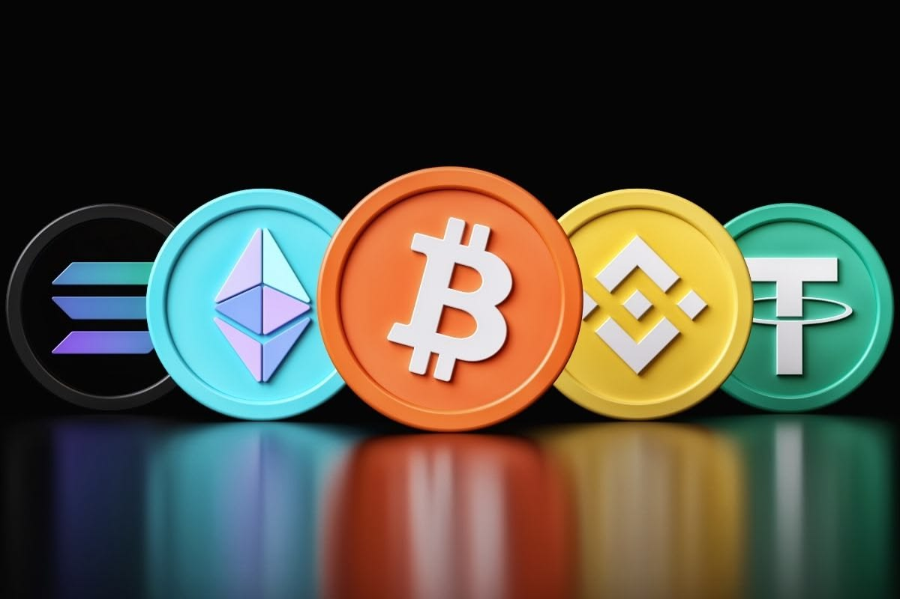
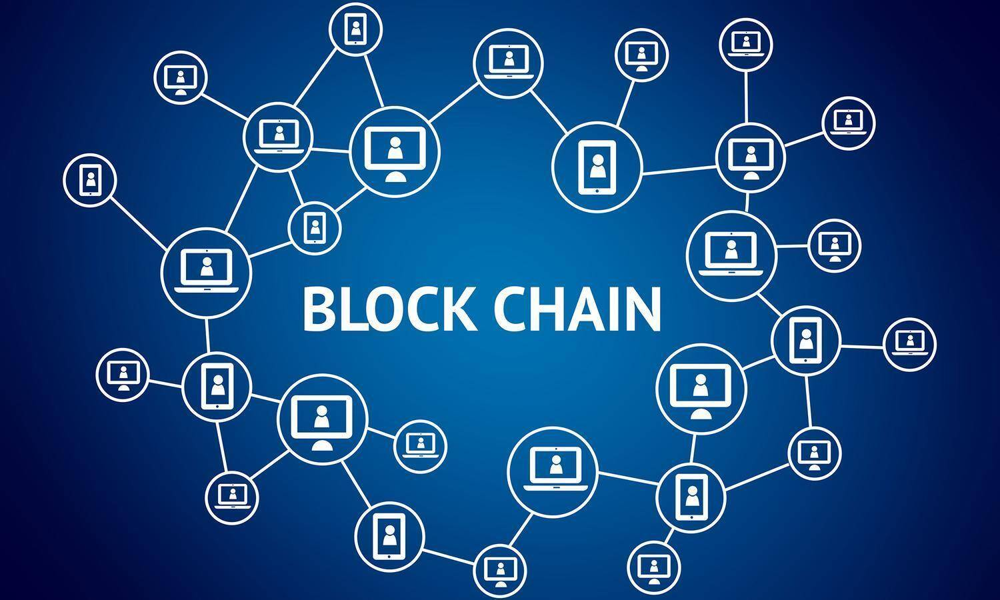

# 01 · Crypto & Blockchain Basics

## What is cryptocurrency?

Cryptocurrency is digital money (coins) secured by cryptography and exchanged through a computer network. You can use it to buy things or as an investment. Crypto has no physical form.

### Crypto vs. bank money

| Bank money (USD, EUR) | Crypto |
|---|---|
| Centralized | Decentralized |
| Controlled by a bank or a payment system (a third party) | Only a sender and a receiver |

## What is a blockchain?

**Simple explanation**
A blockchain is a digital system that records information in a way that makes it very hard to change or hack. It's like a shared database where everyone can see the same data, and once something is added, it can't easily be deleted or altered.

**Technical explanation**
A blockchain is a distributed ledger technology where transactions are grouped into blocks, cryptographically secured, and linked together in chronological order. Each participant in the network holds a copy, and consensus mechanisms (like Proof of Work or Proof of Stake) ensure everyone agrees on the same version of the data.

## Different blockchains

You can withdraw crypto to different networks/blockchains. There are not only the Bitcoin and Ethereum networks but many other large, trusted ones. Solana, Polygon and Arbitrum are good examples. Many major decentralized apps are integrated with these chains.

>  Don't use random scam blockchains, and always check which chain you want to use before you take any action.

## Components of a blockchain

1. **Peer-to-Peer (P2P) network**: a network of equal participants (nodes) with no central server. Nodes share information about transactions and blocks using a *gossip protocol* (each node tells a few others, who tell others, etc.). This makes the network resilient and decentralized.
2. **Messages (transactions)**: messages that represent changes in the system's state. Example: "Alice sends 1 BTC to Bob" changes balances. They are broadcast across the network and later grouped into blocks.
3. **Consensus rules**: define what counts as a valid transaction or block. For example, "a transaction can't spend coins that don't exist" and "a block must include a valid hash and a reference to the previous one". All nodes enforce these rules independently, so no trust is needed.
4. **State machine**: a blockchain can be seen as a state machine that updates its state when valid transactions occur. *State* = current balances, smart contract data, etc. *Transactions* = inputs that cause state transitions. Every valid transaction moves the blockchain from one valid state to the next.
5. **Chain of blocks**: blocks store verified transactions and link to previous blocks using cryptographic hashes. This creates an immutable ledger (journal) of all accepted state transitions.
6. **Consensus algorithm**: ensures everyone agrees on a single version of the chain, through mechanisms like Proof of Work (solve puzzles) or Proof of Stake (stake coins to propose/validate blocks). It distributes control and prevents tampering.
7. **Incentive mechanism**: encourages honest participation through game theory. Miners or validators get block rewards + fees for following the rules, so attacking the system becomes economically unprofitable.
8. **Client implementations**: the actual software nodes run to participate in the network. Bitcoin → Bitcoin Core. Ethereum → Geth, Nethermind, Besu, etc.

## Who stores the blockchain? Miners and validators

**Proof of Work (PoW)**
The people who solve puzzles to validate transactions are called **miners**. When they solve the puzzle (equation), the crypto system rewards them with a new coin. This is called **mining**, and the system is called **Proof of Work**.

**Proof of Stake (PoS)**
Participants called **validators** buy coins and put them at **stake**. The system chooses one of them to validate the transaction, and the more they stake, the higher their chance of being chosen. If they fail, the system **slashes** them, which means they lose their stake (money or coins).

**PoW vs PoS**
In PoW the winner is whoever has the most power (computers, electricity, costs…). In PoS, the chance of being chosen depends on the size of the stake, not on computing power.

## Bitcoin

The first coin and the most valuable. Created in 2009 by Satoshi Nakamoto, with a supply of only 21 million.

## Altcoin

Short for *alternative coin*: any coin except Bitcoin. For example: Ethereum, Solana, memecoins.

## Stablecoins

A stablecoin is a cryptocurrency whose value is pegged to another currency (like the dollar or gold). For example, 1 USDT = 1 USD, so if Tether has 10B USDT tokens it must have 10B USD.

$BTC and $ETH, with their frequent and sometimes sharp price swings, can't yet be a well-functioning store of value. Volatility is great for speculation but it slows down adoption. It is especially unacceptable for large whales.

This is where stablecoins come in. Their prices are pegged to another stable asset like the US dollar, so you can be exposed to crypto by basically holding US dollars.

## Fork

A fork is a split into two versions. It happens for different reasonse e.g. when the team disagrees or protocol/rule change.

Real example: Bitcoin forked into Bitcoin and Bitcoin Cash (one side wanted to increase the block size to make transactions faster).

| Type | What happens |
|---|---|
| **Soft fork** | Backward-compatible: miners continue without any problems or changes |
| **Hard fork** | Not backward-compatible: miners must change/upgrade the system (protocol changes), which can result in another blockchain |

## Coins vs Tokens

**Coins** are the native digital assets of their own blockchain. Examples: Bitcoin (BTC), Ethereum (ETH), Litecoin (LTC).
- *Purpose:* a medium of exchange, store of value, or unit of account within their blockchain ecosystem.

**Tokens** are digital assets built on top of an existing blockchain (created using smart contracts). They rely on the infrastructure of another blockchain (e.g. Ethereum, Binance Smart Chain) to function.
- *Purpose:* they often represent specific utilities, assets, or access to services within a project. They can serve various purposes such as governance, staking, or access to decentralized applications (dApps).

Not all coins offer tokens (it depends from coin to coin).

**Example**
- Ethereum (ETH) is a coin that powers the Ethereum blockchain and is used for gas fees across the network.
- Uniswap (UNI) is a token that grants governance rights in the Uniswap decentralized exchange (DEX) and is built on the Ethereum blockchain.
