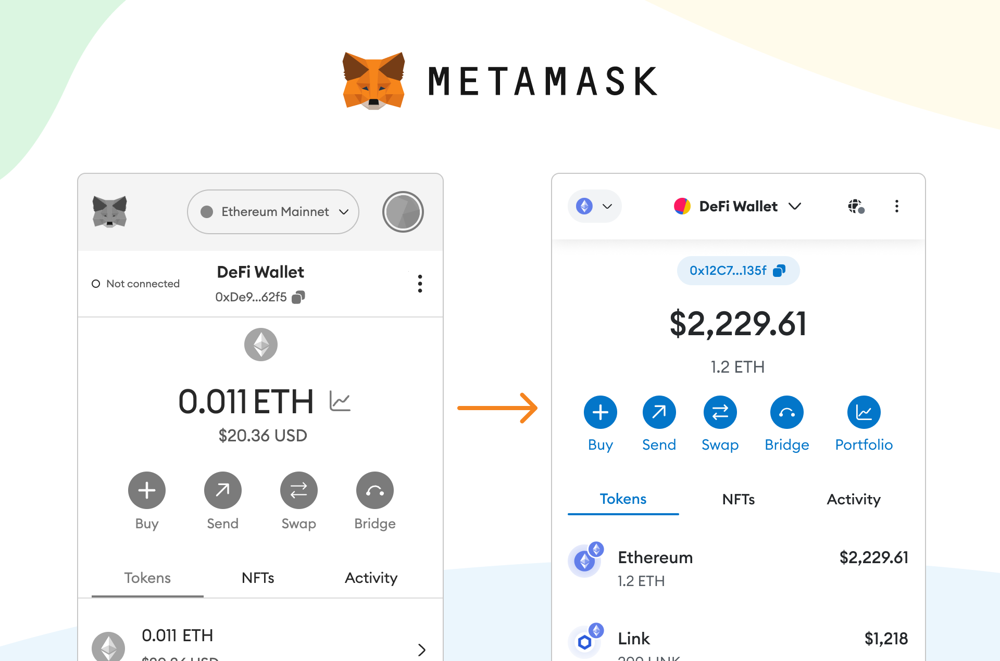
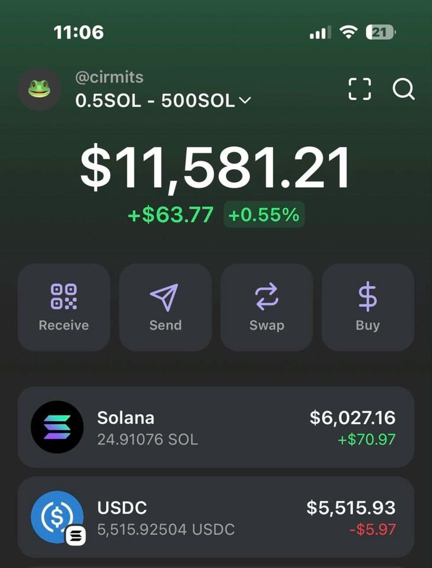

# 02 · Wallets & Keys

## What is a wallet?

A wallet is a software application that gives you control over your account. It is your gateway to the blockchain (like Ethereum). It holds your public/private keys and can create and send transactions on your behalf.

> A crypto wallet does not actually store your cryptocurrencies(They always stay on the blockchain). What the wallet stores are the public and private keys.

## Types of wallets

Wallets are classified in two ways.

**By where the keys are stored**

| Type     | Description                                                |
| -------- | ---------------------------------------------------------- |
| **Hot**  | Keys stored online: easily accessible, vulnerable to hacks |
| **Cold** | Keys stored offline: less convenient, more secure like: Ledger Nano S Plus, Trezor |

**By who controls the keys**

| Type | Examples |
|---|---|
| **Custodial** | Binance, Coinbase, MoonPay |
| **Non-custodial** | MetaMask, Phantom |

**On-ramp / Off-ramp**
- **On-ramp**: you buy crypto with fiat money.
- **Off-ramp**: you sell crypto for fiat money.

## Keys and addresses

- **Public key / address**: the address people use to send you crypto (derived from the public key).
- **Private key**: access and control of funds is done with digital signatures, which are created using the private key. It means you own the cryptocurrency and the wallet, so you must keep it secret.
- **Seed phrase**: a human-readable backup, 12/24 words that generate the private key to every public key.
  - If you have the seed phrase, you can recreate all the private keys.
  - If you only have a private key, you control just one address and cannot regenerate others.

In simple terms: a public key allows you to receive cryptocurrency transactions. It's a cryptographic code paired to a private key. While anyone can send transactions to the public key, you need the private key to unlock them and prove that you are the owner of the cryptocurrency received.

## What is a digital signature?

A digital signature is a cryptographic proof that a message or transaction really came from you, and wasn't changed by anyone.

It is used to:
- Prove ownership of a private key (without showing it)
- Prove the message wasn't altered
- Enable secure, trustless transactions in blockchains

**Crypto version (Ethereum example).** You want to send a transaction:

1. You use your private key to generate a signature of that transaction.
2. You send the message (the transaction) and the signature.
3. The blockchain uses your public key (from your wallet address) to verify the signature:
   - Was it signed by the real private key?
   - Was the message tampered with?
